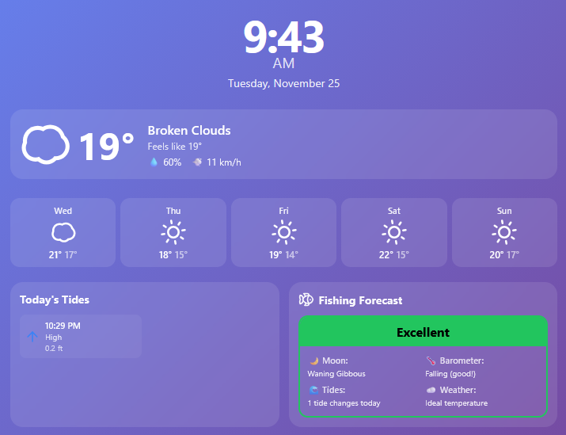

# Pi Weather Display

A sleek, modern weather and clock display designed for Raspberry Pi 3 with a 5-inch touchscreen. Built with React and TypeScript, featuring auto day/night themes, weather forecasts, tide information, and fishing conditions.



## Features

- **Real-time Clock** - Large, easy-to-read time and date display
- **Animated Weather Icons** - Beautiful animated weather icons for current conditions and forecast
- **Current Weather** - Temperature, conditions, humidity, and wind speed (Celsius, km/h)
- **7-Day Forecast** - Week-ahead weather predictions with animated icons
- **Tide Information** - Daily high and low tides (global coverage via WorldTides API)
- **Fishing Forecast** - Conditions rating based on weather, tides, and moon phase
- **Auto Day/Night Theme** - Switches between light and dark themes based on time
- **Single-Page Layout** - Everything visible at once, tides and fishing side by side
- **Smooth Animations** - Framer Motion for polished transitions
- **Optimized for 5-inch Display** - Perfect for 800x480 resolution

## Prerequisites

- Raspberry Pi 3 (or newer)
- 5-inch touchscreen display (800x480 recommended)
- Node.js 18+ and npm
- OpenWeatherMap API key (free tier)

## Setup Instructions

### 1. Get API Keys

**OpenWeatherMap API:**
1. Go to https://openweathermap.org/api
2. Sign up for a free account
3. Navigate to API keys section
4. Copy your API key
5. **Important:** API key activation can take 10 minutes to 2 hours
6. The app uses the free tier APIs (Current Weather + 5 Day Forecast)

**Find Your Coordinates:**
1. Go to https://www.latlong.net/
2. Search for your location
3. Note your latitude and longitude

**WorldTides API (Recommended for Australia & Global):**
1. Visit https://www.worldtides.info/register
2. Sign up for a free account (no credit card required)
3. Get your API key (1000 requests/month free tier)
4. Note: You can test without an API key but with limited requests

**NOAA Tides (US Only - Alternative):**
1. Go to https://tidesandcurrents.noaa.gov/
2. Search for your nearest tide station
3. Note the Station ID
4. Set `VITE_TIDE_API=noaa` in your `.env` file

### 2. Install on Raspberry Pi

```bash
# Clone or copy the project to your Raspberry Pi
cd ~/
git clone <your-repo-url> pi-weather-display
cd pi-weather-display

# Install dependencies
npm install

# Create environment file
cp .env.example .env

# Edit .env with your API key and location
nano .env
```

Update `.env` with your information:
```env
# Weather API
VITE_OPENWEATHER_API_KEY=your_actual_api_key

# Your location (example: Sydney, Australia)
VITE_LATITUDE=-33.8688
VITE_LONGITUDE=151.2093

# Tide API - use 'worldtides' for Australia/Global or 'noaa' for US
VITE_TIDE_API=worldtides

# WorldTides API key (optional for testing, recommended for production)
VITE_WORLDTIDES_API_KEY=your_worldtides_key

# Only needed if using NOAA (US only)
VITE_NOAA_STATION=8518750
```

### 3. Build the Application

```bash
npm run build
```

### 4. Install and Configure Chromium for Fullscreen

```bash
# Install Chromium browser
sudo apt-get update
sudo apt-get install -y chromium unclutter

# Install a simple HTTP server
npm install -g serve
```

### 5. Create Auto-Start Script

Create a startup script:

```bash
nano ~/start-weather-display.sh
```

Add the following content:

```bash
#!/bin/bash

# Hide mouse cursor
#unclutter -idle 0 &

# Start the web server
cd ~/pi-weather-display
serve -s dist -l 3000 &

# Wait for server to start
sleep 5

# Start Chromium in kiosk mode
chromium \
  --kiosk \
  --noerrdialogs \
  --disable-infobars \
  --disable-session-crashed-bubble \
  --disable-restore-session-state \
  --app=http://localhost:3000 \
  --touch-events=enabled \
  --disable-pinch \
  --overscroll-history-navigation=0
```

Make it executable:

```bash
chmod +x ~/start-weather-display.sh
```

### 6. Configure Auto-Start on Boot

Install wtype

```bash
sudo apt -y install wtype
```

edit ".config/labwc/autostart", which is a configuration file used to automatically run programs when the Raspberry Pi OS desktop has loaded.

```bash
nano .config/labwc/autostart
```

Add the following two lines:

```bash
chromium --kiosk --noerrdialogs --disable-infobars --no-first-run --enable-features=OverlayScrollbar --start-maximized &
~/start-weather-display.sh
```

### 7. Disable Screen Blanking (Optional)

Edit the lightdm configuration:

```bash
sudo nano /etc/lightdm/lightdm.conf
```

Find the `[Seat:*]` section and add:

```
xserver-command=X -s 0 -dpms
```

### 8. Reboot

```bash
sudo reboot
```

The display should start automatically in fullscreen mode!

## Development

To run in development mode on your computer:

```bash
# Install dependencies
npm install

# Create .env file (copy from .env.example)
cp .env.example .env

# Add your API keys to .env
nano .env

# Start development server
npm run dev
```

Visit http://localhost:5173 in your browser.

## Project Structure

```
pi-weather-display/
├── src/
│   ├── components/           # React components
│   │   ├── Clock.tsx         # Time and date display
│   │   ├── CurrentWeather.tsx # Current conditions
│   │   ├── WeeklyForecast.tsx # 7-day forecast
│   │   ├── Tides.tsx         # Tide information
│   │   └── FishingConditions.tsx # Fishing forecast
│   ├── hooks/                # Custom React hooks
│   │   ├── useWeather.ts     # Weather API integration
│   │   ├── useTides.ts       # Tide API integration
│   │   └── useFishingConditions.ts # Fishing logic
│   ├── ThemeContext.tsx      # Day/night theme provider
│   ├── types.ts              # TypeScript interfaces
│   ├── App.tsx               # Main app component
│   ├── App.css               # Styles
│   └── main.tsx              # Entry point
├── .env.example              # Environment variables template
├── package.json              # Dependencies
└── README.md                 # This file
```

## Customization

### Change Theme Colors

Edit `src/App.css` and modify the gradient backgrounds:

```css
.app.light {
  background: linear-gradient(135deg, #667eea 0%, #764ba2 100%);
}

.app.dark {
  background: linear-gradient(135deg, #0f2027 0%, #203a43 50%, #2c5364 100%);
}
```

### Adjust Day/Night Transition Time

Edit `src/ThemeContext.tsx` and modify the hour check:

```typescript
const newTheme: Theme = hour >= 6 && hour < 18 ? 'light' : 'dark';
```

### Change Update Intervals

- Weather: `src/hooks/useWeather.ts` (default: 10 minutes)
- Tides: `src/hooks/useTides.ts` (default: 1 hour)
- Theme: `src/ThemeContext.tsx` (default: 1 minute)

### Temperature and Wind Speed Units

The weather API is set to **metric units by default** (Celsius, km/h):
- Temperature: Celsius (°C)
- Wind speed: Kilometers per hour (km/h)

To change to imperial units (Fahrenheit, mph), edit `src/hooks/useWeather.ts`:

```typescript
// Line 58 and Line 70 - Change both occurrences
units=imperial  // Change from units=metric
```

Then update `src/components/CurrentWeather.tsx`:
```typescript
// Line 46 - Remove the *3.6 conversion
<span>💨 {Math.round(current.wind_speed)} mph</span>
```

And update `src/hooks/useFishingConditions.ts` temperature thresholds back to Fahrenheit.

## Troubleshooting

**Weather not loading:**
- Check your API key in `.env`
- Verify your coordinates are correct
- Check internet connection
- OpenWeatherMap free tier may have delays

**Tides not showing:**
- Check your latitude/longitude are correct
- Verify `VITE_TIDE_API` is set to `worldtides` (for Australia/global)
- If using WorldTides without API key, you may hit rate limits
- Get a free API key at https://www.worldtides.info/register
- For US locations, you can use `VITE_TIDE_API=noaa` with a station ID
- Some inland areas may not have tide data available

**Screen not turning off:**
- Verify the autostart configuration
- Check lightdm.conf settings
- Some displays may need additional configuration

**Touch not working:**
- Ensure your display drivers are installed
- Check if touch is enabled in Raspberry Pi config

## APIs Used

- **OpenWeatherMap** - Weather data (https://openweathermap.org/api)
- **WorldTides** - Global tide predictions including Australia (https://www.worldtides.info/)
- **NOAA Tides & Currents** - US tide predictions (https://tidesandcurrents.noaa.gov/)

## License

MIT License - feel free to use and modify for your own projects!

## Credits

Built with:
- React + TypeScript
- Vite
- Framer Motion
- date-fns
- Lucide React Icons
